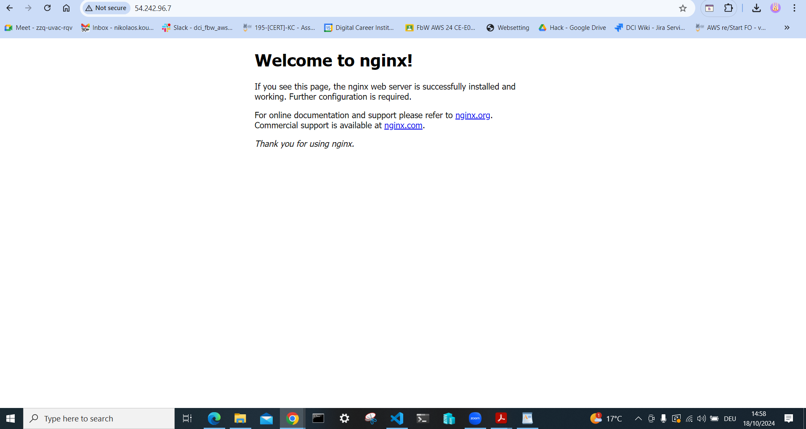

# AWS CloudFormation Project for Static Website

This project demonstrates how to deploy a static website using AWS CloudFormation. The template creates the necessary resources, including an EC2 instance running Nginx and an S3 bucket for hosting the static files.

## Prerequisites

Before you begin, ensure you have the following:

- An AWS account with the necessary permissions to create CloudFormation stacks and EC2 instances.
- AWS CLI installed and configured with your access keys.
- Basic knowledge of AWS services, particularly EC2, S3, and CloudFormation.

## Resources Created

- EC2 Instance: Runs an Nginx web server.
- S3 Bucket: Stores the static website files.

## CloudFormation Template

The CloudFormation template is located in the `cloudformation.yaml` file. It defines all the resources required to set up the static website.

### Template Overview

- **S3 Bucket**: Stores the HTML file for the website.
- **EC2 Instance**: Serves the content of the S3 bucket using Nginx.

## Deployment Instructions

1. Clone this repository:

   ```bash
   git clone https://github.com/nikassos81/cloudformation-template-ec2-nginx-s3.git
   cd cloudformation-template-ec2-nginx-s3
   ```
## Demonstration
  
*Screenshot of the website in a web browser.*

## License
This project is licensed under the MIT License - see the [LICENSE](LICENSE) file for details.
